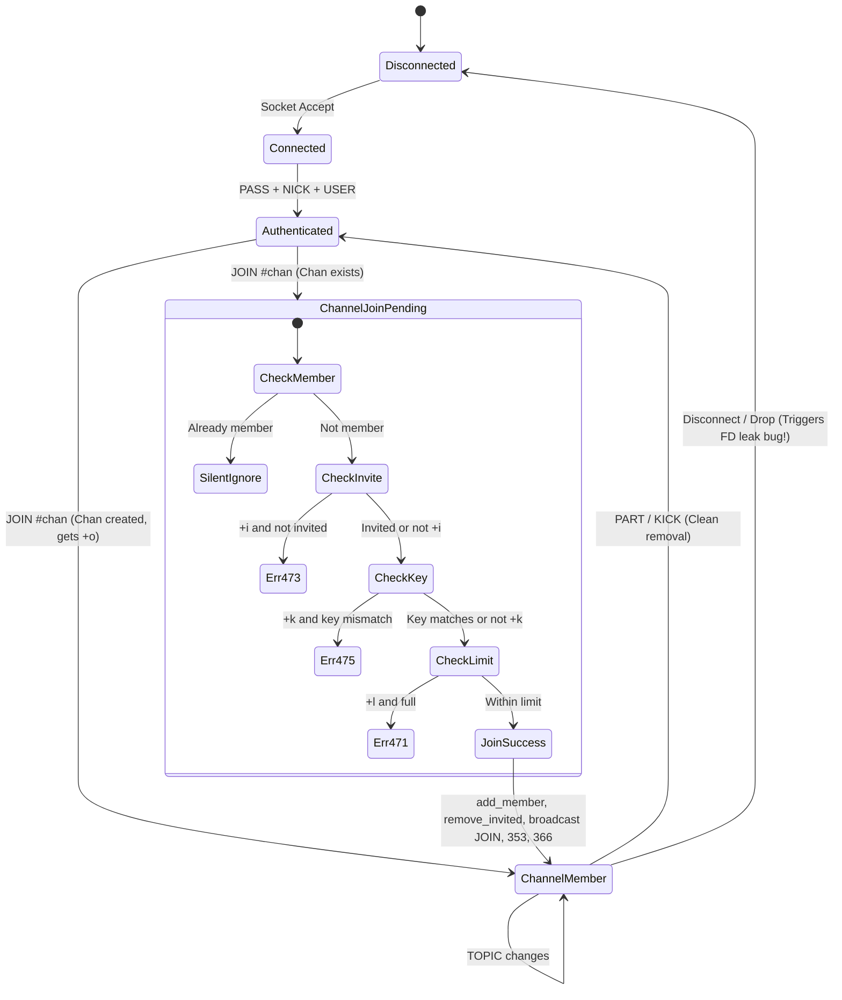

# Comprehensive JOIN Command Flow & Edge Case Analysis

This document provides an exhaustive, line-by-line breakdown of the `JOIN` command lifecycle in `ft_irc`. It details input grammar edge cases, state transitions, security vulnerabilities, command interactions, and reachable failure modes.

---

## 1. Flow Overview & Architecture

### High-Level Architecture Diagram
```
                      [Raw Socket Stream]
                              │
                              ▼
                      Server::handle_client_input (reads up to 512 bytes)
                              │
                              ▼
                      Server::handle_line (extracts line delimited by \r\n)
                              │
                              ▼
                      Server::split_arguments (splits by ' ', ignores empty tokens)
                              │
                              ▼
                      Server::dispatch_command
                              │
        ┌─────────────────────┴─────────────────────┐
        ▼                                           ▼
[Unregistered Client]                       [Registered Client]
!client.get_register_status()                command == "JOIN"
        │                                           │
        ▼                                           ▼
send_status(451,                            Server::handle_join_command
":You have not registered")                         │
                                                    ▼
                                    arguments.empty()? ──Yes──► send_status(461, "JOIN :Not enough parameters")
                                                    │ No
                                                    ▼
                                    chan[0] != '#' && chan[0] != '&'? ──Yes──► send_status(403, "<chan> :No such channel")
                                                    │ No
                                                    ▼
                                    Extract key (arguments[1] if present)
                                                    │
                                                    ▼
                                    Server::let_client_join_channel(channel_name, client, key)
                                                    │
                     ┌──────────────────────────────┴──────────────────────────────┐
                     ▼                                                             ▼
        [Channel Does Not Exist]                                       [Channel Already Exists]
         create_new_channel(channel_name)                               channel.has_member(client_fd)?
                     │                                                             │ Yes ──► (Silent NO-OP return)
                     ├─► add_member(client_fd)                                     │ No
                     ├─► add_operator(client_fd)                                   ▼
                     ├─► broadcast(client, "JOIN")                    channel.is_invite_only() (+i)
                     ├─► send_channel_names_reply                     && !is_invited(client_fd)
                     │     (353 RPL_NAMREPLY & 366 RPL_ENDOFNAMES)    && !is_operator(client_fd)?
                     └─► Return                                                    │ Yes ──► send_status(473, "<chan> :Cannot join channel (+i)")
                                                                                   │ No
                                                                                   ▼
                                                                      channel.has_key() (+k)
                                                                      && channel.get_key() != key?
                                                                                   │ Yes ──► send_status(475, "<chan> :Cannot join channel (+k)")
                                                                                   │ No
                                                                                   ▼
                                                                      channel.has_user_limit() (+l)
                                                                      && members.size() >= limit?
                                                                                   │ Yes ──► send_status(471, "<chan> :Cannot join channel (+l)")
                                                                                   │ No
                                                                                   ▼
                                                                      channel.add_member(client_fd)
                                                                      channel.remove_invited(client_fd)
                                                                      channel.broadcast(client, "JOIN")
                                                                      send_channel_names_reply(client, channel_name)
```

---

## 2. Line-by-Line Code Analysis & Edge Case Inventory

### A. Input Parsing & Grammar Edge Cases (`ServerCommands.cpp`, `ServerHelper.cpp`)

#### 1. Lack of Multi-Channel & Batch Key Support (`JOIN #chan1,#chan2 key1,key2`)
- **Code Reference**: `ServerCommands.cpp:189-199`
  ```cpp
  const Wire &chan = arguments[0];
  if (chan.empty() || (chan[0] != '#' && chan[0] != '&')) {
      send_status(client, "403", chan + " :No such channel");
      return ;
  }
  Wire key;
  if (arguments.size() > 1)
      key = arguments[1];
  let_client_join_channel(chan, client, key);
  ```
- **RFC Standard (RFC 2812 §3.2.1)**: `JOIN <channel>{,<channel>} [<key>{,<key>}]` allows batch joining multiple channels in a single command.
- **Flaw**: `arguments[0]` is treated as a single literal channel name.
- **Behavior**: Sending `JOIN #chan1,#chan2` creates and joins a channel named literally `"#chan1,#chan2"`.
- **Impact**: Any IRC client with auto-join configured for multiple rooms fails to join individual channels.

#### 2. Special RFC Command `JOIN 0` (Part All Channels) Rejection
- **Code Reference**: `ServerCommands.cpp:190`
  ```cpp
  if (chan.empty() || (chan[0] != '#' && chan[0] != '&'))
  ```
- **RFC Standard**: `JOIN 0` is the standard IRC control command to immediately leave all channels the client is currently in.
- **Flaw**: `chan[0] == '0'`, which does not match `'#'` or `'&'`.
- **Result**: Returns `403 0 :No such channel` instead of parting all channels.

#### 3. Trailing Colon Rejection on Channel Name (`JOIN :#channel`)
- **Code Reference**: `ServerHelper.cpp:41` (`split_arguments`)
- **Flaw**: `split_arguments` splits on spaces. If a client sends `JOIN :#channel`, `arguments[0]` becomes `":#channel"`.
- **Result**: `chan[0]` is `':'`, triggering `403 :#channel :No such channel`. Standard IRC clients sending `:` for trailing arguments cannot join channels.

#### 4. Trailing Colon on Key Parameter (`JOIN #chan :secretkey`)
- **Flaw**: If a channel is set with key `secretkey` via `MODE #chan +k secretkey`, and a client joins with `JOIN #chan :secretkey`, `arguments[1]` is parsed as `":secretkey"`.
- **Result**: `channel.get_key() != key` (`"secretkey" != ":secretkey"`), returning `475 :Cannot join channel (+k)`.

#### 5. Missing Channel Name Sanitization & Length Limits
- **RFC Standard**: Channel names must be up to 50 characters, cannot contain spaces, ASCII 7 (bell/`\a`), commas, or colons.
- **Flaw**: The server accepts channel names of arbitrary length (e.g. 10,000 characters) and invalid characters (e.g. `#chan,name`, `#chan:name`, `#chan\a`).
- **Result**: Unbounded channel names will cause `353 RPL_NAMREPLY` and `JOIN` broadcasts to exceed the 512-byte IRC message limit, causing message truncation or client crashes.

#### 6. Prefix Inconsistency Across Commands (`#` vs `&`)
- `JOIN` allows both `#` and `&` (`chan[0] == '#' || chan[0] == '&'`).
- `MODE` only permits `#` (`ServerChannelOps.cpp:354`: `if (channel_name.empty() || channel_name[0] != '#') return ;`).
- `PRIVMSG` only permits `#` (`ServerCommands.cpp:254`: `if (!channel_or_user_name.empty() && channel_or_user_name[0] == '#')`).
- **Consequence**: A user can join `&localchan`, but cannot chat in it (`PRIVMSG` treats `&localchan` as a nickname and fails with `401`) and cannot manage channel modes (`MODE` silently ignores `&localchan`).

---

### B. State Management, Resource Leaks & Security Flaws

#### 7. Critical: File Descriptor Recycling Grants Ghost Operator Status
- **Code Reference**: `ServerLoop.cpp:62-72` vs `Channel.cpp:118-125`
  ```cpp
  // ServerLoop.cpp: disconnect_client
  void Server::disconnect_client(int client_fd) {
    Vector<Wire> empty_channels;
    for (ChannelMap::iterator it = get_channels().begin(); it != get_channels().end(); ++it) {
      it->second.remove_member(client_fd); // <-- ONLY removes member!
      if (it->second.empty())
        empty_channels.push_back(it->first);
    }
    for (size_t i = 0; i < empty_channels.size(); ++i)
      remove_channel(empty_channels[i]);
    ...
  }
  ```
- **The Bug**: `disconnect_client` only calls `remove_member(client_fd)`. It **NEVER** calls `remove_operator(client_fd)` or `remove_client_from_channel(client_fd)`.
- **Attack / Failure Scenario**:
  1. Client Alice (FD 5) joins `#test` and becomes Channel Operator. Client Bob (FD 6) also joins `#test`.
  2. Alice disconnects (FD 5 is closed and returned to the OS).
  3. `#test` is not empty (Bob is still in it), so `#test` remains active.
  4. In `#test`, `operator_fds` STILL contains `5`!
  5. A new user, Mallory, connects to the server. The OS kernel assigns the lowest available file descriptor, which is FD 5.
  6. Mallory registers and sends `JOIN #test`.
  7. `let_client_join_channel` checks `is_operator(5)`, which is `true`!
  8. Mallory is added to `member_fds` and **instantly has operator privileges** without ever being granted `+o`!
  9. In `send_channel_names_reply`, Mallory is listed with `@Mallory`. Mallory can now kick Bob or alter channel modes.

#### 8. Critical: File Descriptor Recycling Grants Ghost Invite Privileges (+i Bypass)
- **Code Reference**: `ServerChannelOps.cpp:153` (`handle_invite`) and `ServerLoop.cpp:65`
- **The Bug**: `handle_invite` executes `channel.add_invited(target.get_socket())`. If the invited client disconnects without joining, `disconnect_client` does NOT remove the FD from `invited_fds` in channels where the client was not a member.
- **Attack Scenario**:
  1. Operator invites Alice (FD 5) to secret invite-only room `#secret` (`+i`).
  2. Alice disconnects without joining.
  3. Attacker connects and is assigned recycled FD 5.
  4. Attacker sends `JOIN #secret`.
  5. `let_client_join_channel` checks `channel.is_invited(5)` -> evaluates to `true`!
  6. Attacker gains access to `#secret` without authorization.

#### 9. Case-Sensitivity Bug in Channel Map Lookups
- **Code Reference**: `Server.cpp:167` (`get_channel`), `ChannelMap` is `Map<Wire, Channel>`
- **RFC Standard**: Channel names are case-insensitive (`#lobby` == `#LOBBY` == `#Lobby`).
- **Behavior in Code**: `Map::fetch` performs an exact `string::operator==` match.
- **Failure Scenario**:
  1. User 1 joins `JOIN #room` -> Channel `#room` created. User 1 is Op.
  2. User 2 joins `JOIN #ROOM` -> `get_channel("#ROOM")` fails to find `#room`. A second distinct channel `#ROOM` is created. User 2 is Op of `#ROOM`.
  3. User 1 and User 2 are in two separate channels with case-differing names.
  4. If User 1 sends `PRIVMSG #ROOM :hi`, it goes to `#ROOM` (User 2) while User 1 is in `#room`.

#### 10. Silent Return on Re-Joining Joined Channel
- **Code Reference**: `ServerCommands.cpp:32-36`
  ```cpp
  if (channel.has_member(client_fd))
  {
      print("Client is already in channel ", channel_name, "!");
      return ;
  }
  ```
- **Behavior**: If an already-joined client sends `JOIN #chan`, the server silently returns.
- **Impact**: It skips `send_channel_names_reply`. In standard IRC, clients re-issuing `JOIN #chan` expect an updated `353 RPL_NAMREPLY` / `366 RPL_ENDOFNAMES` sync.

---

### C. Numeric Replies & RFC Protocol Compliance

#### 11. Missing Channel Topic Numeric Replies (`RPL_TOPIC` 332 / `RPL_NOTOPIC` 331)
- **RFC Standard (RFC 2812 §3.2.1)**: *"If a JOIN is successful, the user is then sent the channel's topic (using RPL_TOPIC) and the list of users who are on the channel (using RPL_NAMREPLY)."*
- **Code Reference**: `ServerCommands.cpp:68`
  ```cpp
  send_channel_names_reply(client, channel_name);
  ```
- **Flaw**: No `332 RPL_TOPIC` or `331 RPL_NOTOPIC` is sent upon joining.
- **Impact**: Clients joining a channel with an existing topic will display an empty topic bar in their UI until a new topic is set.

#### 12. Unbounded Line Length in `353 RPL_NAMREPLY`
- **Code Reference**: `ServerMessaging.cpp:114-117`
  ```cpp
  Wire names = channel.get_member_fds().reduce(collect_channel_member_names, get_clients(), channel);
  send_status(client, "353", "= " + channel_name + " :" + names);
  send_status(client, "366", channel_name + " :End of /NAMES list");
  ```
- **Flaw**: If a channel contains 50+ members, all nicknames are concatenated into a single string.
- **Impact**: The generated `353` message can easily exceed the 512-byte IRC line limit. Compliant clients or proxy bouncers will truncate the names list or disconnect due to line length overflow.

---

### D. Channel Modes Interaction with `JOIN`

| Mode | Flag | Check in `let_client_join_channel` | Edge Case / Vulnerability |
| :--- | :--- | :--- | :--- |
| **Invite-Only** | `+i` | `channel.is_invite_only() && !channel.is_invited(client_fd) && !channel.is_operator(client_fd)` | 1. Ghost operator/invite FD recycling bypasses `+i`.<br>2. `is_operator` check is redundant and dangerous for non-members. |
| **Key / Password**| `+k` | `channel.has_key() && channel.get_key() != key` | 1. Leading colons on key argument (`:secret`) cause key mismatches.<br>2. Keys containing spaces or non-alphanumeric chars can desynchronize between MODE and JOIN. |
| **User Limit** | `+l` | `channel.has_user_limit() && channel.get_member_fds().size() >= channel.get_user_limit()` | 1. If limit is reached, error `471` is returned.<br>2. If limit is set to `0` or negative, behavior depends on `is_positive_number`. |
| **Topic Protect**| `+t` | Handled during `TOPIC` command | Upon `JOIN`, topic is not sent, obscuring topic status from joining client. |
| **Operator** | `+o` | Creator gets `+o` automatically | If all operators part/quit, channel becomes op-less until channel empties and is recreated. |

---

### E. Complex Multi-Command State Interactions



#### 13. Interaction: `JOIN` + `PART` + `JOIN` (Channel Recreation Cycle)
- Client creates `#chan` (becomes Op), sets modes `+i +k pass +t`.
- Client sends `PART #chan`. Channel has 0 members and is destroyed via `server->remove_channel(name)`.
- Client sends `JOIN #chan` (no key).
- Channel is created afresh with default settings (no key, no invite-only).
- *Status*: Working as expected for ephemeral channels per IRC design.

#### 14. Interaction: `JOIN` + `KICK` + `JOIN`
- Operator kicks Target from `#chan`.
- `handle_kick` broadcasts KICK and executes `remove_client_from_channel(target.get_socket())`.
- `remove_client_from_channel` clears `invited`, `operator`, and `member` sets.
- If `#chan` is `+i`, Target cannot rejoin without a new `INVITE`.
- *Status*: Clean state teardown on explicit KICK.

#### 15. Interaction: `JOIN` + `QUIT` / Network Drop + Reconnection (The Operator Hijack Exploit)
- User 1 (FD 5) joins `#alpha` and is operator. User 2 (FD 6) is regular member.
- User 1's connection drops ungracefully (TCP reset / kill).
- Server runs `disconnect_client(5)`:
  - `remove_member(5)` removes 5 from `#alpha.member_fds`.
  - `operator_fds` STILL HAS 5.
- Attacker connects, gets FD 5.
- Attacker authenticates as Mallory and joins `JOIN #alpha`.
- Server checks `is_operator(5)` -> `true`!
- **Mallory is granted Operator status without authorization**.

---

### F. DoS & Resource Exhaustion Vectors

#### 16. Unbounded Channel Creation Flooding
- A client can send `JOIN #1`, `JOIN #2`, ... `JOIN #999999` in a loop.
- No `MAXCHANNELS` or user channel join limit is enforced.
- Memory grows unbounded until the server runs out of heap space.

#### 17. Flooding Pipelined JOINs
- A single `recv()` block (512 bytes) can hold `JOIN #a\r\nJOIN #b\r\nJOIN #c\r\n...`.
- `handle_client_input` processes all lines in a tight loop.
- Large bursts of channel joins with many members trigger huge broadcasts, potentially overflowing client `out_buffer` (> 1MB) and triggering disconnects via `MAX_OUTPUT_BUFFER_SIZE`.

---

## 3. Summary of Edge Cases & Vulnerabilities

| ID | Category | Severity | Description |
| :--- | :--- | :--- | :--- |
| **#1** | Grammar / Input | Medium | No comma-separated multi-channel join (`JOIN #c1,#c2`) support. |
| **#2** | RFC Protocol | Low | `JOIN 0` (leave all channels) is rejected with error 403. |
| **#3** | Grammar / Input | High | Leading colons on channel (`JOIN :#chan`) or keys (`JOIN #c :k`) fail. |
| **#4** | Grammar / Input | Medium | Channel names with arbitrary length, commas, or control chars are permitted. |
| **#5** | Inconsistency | Medium | `&channel` prefix allowed in JOIN, but broken in MODE and PRIVMSG. |
| **#6** | **Security / State** | **CRITICAL** | **FD reuse after disconnect leaks Operator privileges to new clients.** |
| **#7** | **Security / State** | **CRITICAL** | **FD reuse after disconnect leaks pending Channel Invites to new clients.** |
| **#8** | State / Lookup | High | Channel names are case-sensitive, creating duplicate channels (`#chan` vs `#CHAN`). |
| **#9** | RFC Protocol | Medium | Missing `332 RPL_TOPIC` / `331 RPL_NOTOPIC` response on successful join. |
| **#10**| Protocol / Framing| Medium | `353 RPL_NAMREPLY` does not split lines exceeding 512 bytes for large channels. |
| **#11**| DoS / Resource | Medium | No limit on max channels per user or global channel creation count. |
