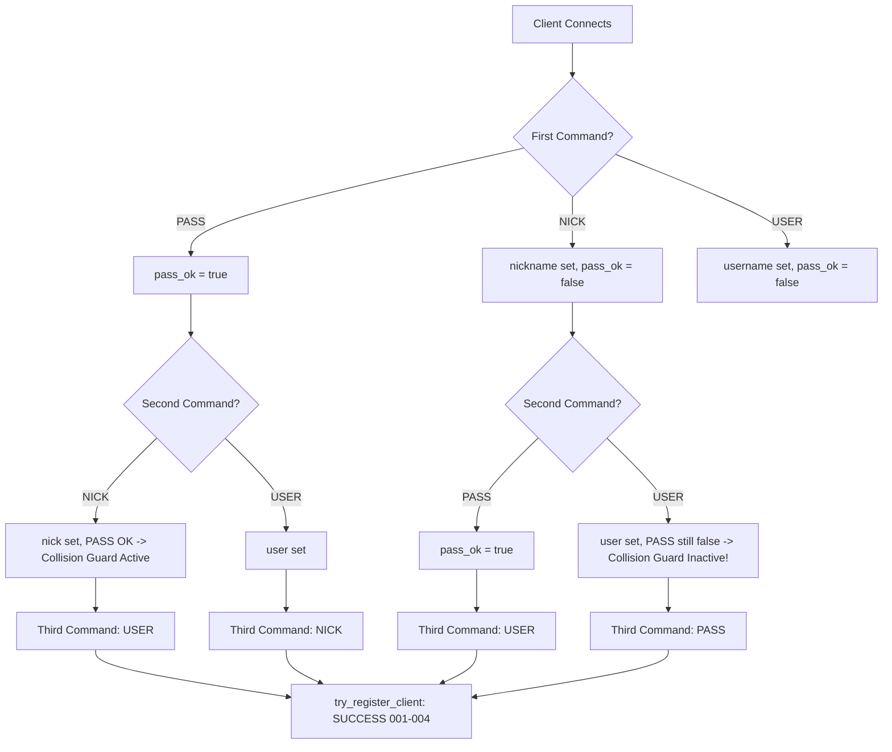

# Detailed NICK Command Analysis: Lifecycle, Edge Cases & Interactions

A comprehensive, line-by-line audit of the `NICK` command implementation in `ft_irc` across the entire codebase (`ServerCommands.cpp`, `ServerHelper.cpp`, `Server.cpp`, `ServerMessaging.cpp`, `ServerLoop.cpp`, `Client.cpp`, `Channel.cpp`, and `Wire.hpp`).

---

## Table of Contents
1. [End-to-End Flow Diagram](#1-end-to-end-flow-diagram)
2. [Code Trace & State Transitions](#2-code-trace--state-transitions)
3. [Deep Edge Case Matrix](#3-deep-edge-case-matrix)
   - [A. Input Parsing & Grammar Edge Cases](#a-input-parsing--grammar-edge-cases)
   - [B. Nickname Collision & State Machine Race Conditions](#b-nickname-collision--state-machine-race-conditions)
   - [C. Case Sensitivity Flaws](#c-case-sensitivity-flaws)
   - [D. Nickname Broadcasting & Audience Edge Cases](#d-nickname-broadcasting--audience-edge-cases)
   - [E. Unregistered vs. Registered State Inconsistencies](#e-unregistered-vs-registered-state-inconsistencies)
4. [Command Interactions (What Happens When NICK Interacts With...)](#4-command-interactions)
   - [1. NICK + PASS & USER (Registration Variations)](#1-nick--pass--user-registration-variations)
   - [2. NICK + PRIVMSG / NOTICE](#2-nick--privmsg--notice)
   - [3. NICK + JOIN / PART / NAMES](#3-nick--join--part--names)
   - [4. NICK + MODE (+o / -o)](#4-nick--mode-o---o)
   - [5. NICK + KICK](#5-nick--kick)
   - [6. NICK + INVITE](#6-nick--invite)
   - [7. NICK + QUIT / Socket Disconnect](#7-nick--quit--socket-disconnect)
5. [Summary of Critical Vulnerabilities & Recommended Fixes](#5-summary-of-critical-vulnerabilities--recommended-fixes)

---

## 1. End-to-End Flow Diagram

```
[ TCP Inbound Packet: "NICK alice\r\n" ]
         │
         ▼
[ ServerLoop.cpp: handle_client_input(fd) ]
   - recv() into client buffer
   - Checks input_exceeds_irc_line_limit (<= 510 chars before \r\n)
         │
         ▼
[ ServerCommands.cpp: handle_line(client, pos) ]
   - Extracts line, strips "\r\n"
   - Extracts command: line.splitBy(' ')[0].toUpper() -> "NICK"
   - Calls split_arguments(line) -> ["alice"]
   - Calls dispatch_command(client, "NICK", line, arguments)
         │
         ▼
[ ServerCommands.cpp: handle_nick_command(client, arguments) ]
   │
   ├─► 1. Check: arguments.empty()?
   │        └─► YES: send_status(client, "431", ":No nickname given") -> RETURN
   │
   ├─► 2. Check: !is_valid_nickname(arguments[0])?
   │        └─► YES: send_status(client, "432", nick + " :Erroneous nickname") -> RETURN
   │
   ├─► 3. Collision Check: existing_client = get_client(arguments[0])
   │        └─► if existing && socket != client.fd && (registered || pass_ok):
   │                 send_status(client, "433", nick + " :Nickname is already in use") -> RETURN
   │
   ├─► 4. If client.get_register_status() == true:
   │        └─► audience = get_client_audience(fd).add(fd)
   │        └─► broadcast ":oldnick!user@localhost NICK :newnick" to audience
   │
   ├─► 5. client.set_nickname(new_nick)
   │
   └─► 6. try_register_client(client)
            └─► If (pass_ok && !user.empty() && !nick.empty() && !registered):
                     - client.set_register_status(true)
                     - send RPL_WELCOME (001), 002, 003, 004
```

---

## 2. Code Trace & State Transitions

### State Variables Involved:
- `Client::nickname` (`Wire`): current nickname string.
- `Client::pass_ok` (`bool`): whether correct PASS was received.
- `Client::is_registered` (`bool`): whether client completed 001 welcome registration.
- `Client::username` (`Wire`): username set by USER command.
- `Server::clients` (`Map<int, Client>`): socket fd -> Client object.

### State Transitions Table for NICK:

| Current Client State | NICK Input | New Client State | Replies / Messages Sent |
| :--- | :--- | :--- | :--- |
| Unregistered, no PASS, no USER | `NICK alice` | `nick="alice"`, unreg | None (no welcome yet) |
| Unregistered, PASS ok, no USER | `NICK alice` | `nick="alice"`, unreg | None (waiting for USER) |
| Unregistered, no PASS, USER set | `NICK alice` | `nick="alice"`, unreg | None (waiting for PASS) |
| Unregistered, PASS ok, USER set | `NICK alice` | `nick="alice"`, **REGISTERED** | **001, 002, 003, 004 (RPL_WELCOME)** |
| Registered as `alice` | `NICK bob` (available) | `nick="bob"`, registered | `:alice!user@host NICK :bob` to audience + self |
| Registered as `alice` | `NICK charlie` (taken) | `nick="alice"`, registered | `433 alice charlie :Nickname is already in use` |
| Registered as `alice` | `NICK invalid@nick` | `nick="alice"`, registered | `432 alice invalid@nick :Erroneous nickname` |
| Registered as `alice` | `NICK` (empty) | `nick="alice"`, registered | `431 alice :No nickname given` |

---

## 3. Deep Edge Case Matrix

### A. Input Parsing & Grammar Edge Cases

| ID | Scenario / Input | Expected RFC Behavior | Current Code Behavior | Severity | Root Cause |
| :--- | :--- | :--- | :--- | :--- | :--- |
| **A1** | `NICK :validnick` (trailing colon syntax) | Accepted as nickname `validnick` | **Rejected with `432 :validnick :Erroneous nickname`** | **CRITICAL** | `split_arguments` does not strip leading `:` from parameters; `is_valid_nickname` rejects `:` as non-alphanumeric. Standard IRC clients (Irssi, HexChat, WeeChat) fail to connect. |
| **A2** | Nickname with valid RFC special chars (e.g. `[Bot]`, `alice\|away`, `{test}`, `user^`, `dev-1`) | Valid nickname accepted | **Rejected with `432 :Erroneous nickname`** | **HIGH** | `is_valid_nickname` uses `hasOnlyAlphaNum("_")`, which rejects `[`, `]`, `\`, `` ` ``, `^`, `{`, `\|`, `}`, `-`. |
| **A3** | Nickname starting with a digit (e.g. `NICK 12345` or `NICK 007`) | Rejected (RFC 2812 §2.3.1: must start with letter/special) | **Accepted** as valid nickname | **MEDIUM** | `hasOnlyAlphaNum` allows numeric first character. IRC routing/parsers may confuse nick `404` with numeric reply `404 ERR_CANNOTSENDTOCHAN`. |
| **A4** | Arbitrarily long nickname (e.g. 500 characters) | Truncated to max length (e.g. 9 or 32) or rejected | **Accepted without length limit** | **HIGH** | No length check in `is_valid_nickname`. Broadcast messages (`:500char_nick!user@host NICK :500char_nick`) exceed 512-byte IRC line limit, causing packet truncation or client crashes. |
| **A5** | `NICK` without arguments or `NICK \r\n` | `431 :No nickname given` | Sends `431 :No nickname given` | OK | Handled correctly (`arguments.empty()`). |
| **A6** | `NICK ` with multiple trailing spaces (`NICK alice \r\n`) | Accepted as `alice` | `split_arguments` filters empty tokens -> produces `["alice"]`. Accepted. | OK | Handled correctly by `.filter(is_empty)`. |
| **A7** | Extra parameters (e.g. `NICK alice 1` - hopcount) | Hopcount ignored, `alice` accepted | `arguments[0]` is used, `arguments[1]` ignored. | OK | Compliant with RFC hopcount handling. |
| **A8** | Leading spaces in command line (e.g. ` NICK alice\r\n`) | Parse command | `line.splitBy(' ')[0]` is empty -> returns `421 Unknown command.` | LOW / RFC STRICT | Documented design decision in `ServerCommands.cpp:325`. |

---

### B. Nickname Collision & State Machine Race Conditions

| ID | Scenario | Expected Behavior | Current Code Behavior | Severity | Detailed Impact |
| :--- | :--- | :--- | :--- | :--- | :--- |
| **B1** | **Unregistered Nickname Collision / Dual Registration Bug** | Reject second client with 433, or re-check collision at registration time | **Both clients register with the EXACT SAME nickname** | **CRITICAL** | **Walkthrough**:<br>1. Client 1 connects, sends `NICK charlie` (no PASS yet -> `pass_ok=false`, `registered=false`).<br>2. Client 2 connects, sends `NICK charlie`. Collision check `(registered \|\| pass_ok)` is FALSE for Client 1!<br>3. Collision check passes. Both Client 1 & 2 have `nickname="charlie"`.<br>4. Client 1 sends `PASS` + `USER` -> registers as `"charlie"`.<br>5. Client 2 sends `PASS` + `USER` -> `try_register_client` does NOT check collision and ALSO registers Client 2 as `"charlie"`!<br>**Result**: Server state corrupted; two clients share same nick. |
| **B2** | **Registration Order Asymmetry** | Command order (PASS->NICK->USER vs NICK->PASS->USER) should behave identically | **Inconsistent collision protection depending on command arrival order** | **HIGH** | If Client 1 sends PASS first, collision protection is active (`pass_ok=true`). If Client 1 sends NICK first, collision protection is completely disabled until PASS arrives. |
| **B3** | **Nick Change Collision for Registered User** | If `alice` attempts to rename to `bob` (active), reject with 433 and retain `alice` | Properly sends `433 :Nickname is already in use`, retains `alice`. | OK | Handled properly when target client is registered. |
| **B4** | **Nick Change to Same Nickname (Self-Rename)** | Either silently ignore, send no-op, or broadcast | Broadcasts `:alice!user@host NICK :alice` to audience + self | LOW / TRIVIAL | Harmless duplicate broadcast. |

---

### C. Case Sensitivity Flaws

| ID | Scenario | Expected Behavior | Current Code Behavior | Severity | Root Cause |
| :--- | :--- | :--- | :--- | :--- | :--- |
| **C1** | **Case Collision Bypass** (`Alice` vs `alice`) | `alice` matches `Alice` -> rejected with `433 ERR_NICKNAMEINUSE` | **Accepted as different nicknames** | **CRITICAL** | `match_nickname` uses case-sensitive `==` (`c.get_nickname() == nick`). Both `Alice` and `alice` can exist simultaneously. |
| **C2** | **Case Mismatch in PRIVMSG / KICK / MODE** | `/msg ALICE hello` or `/kick #chan ALICE` targets `Alice` | **Fails with `401 :No such nick/channel`** | **HIGH** | Target lookup `get_client("ALICE")` fails because comparison is case-sensitive. |
| **C3** | **Self Case Change** (`alice` -> `Alice`) | Allows user to change case | Finds self (same socket) and permits update. | OK | Permitted because socket matches. |

---

### D. Nickname Broadcasting & Audience Edge Cases

| ID | Scenario | Expected Behavior | Current Code Behavior | Severity | Root Cause |
| :--- | :--- | :--- | :--- | :--- | :--- |
| **D1** | Client in 0 channels changes nickname | Client receives self-notification `:old!user@host NICK :new` | Audience is empty set, `.add(client_fd)` sends only to self. | OK | Correctly informs the client of successful rename. |
| **D2** | Client in multiple channels with overlapping members | Each mutual member receives NICK message **exactly once** | `get_client_audience` returns `Set<int>` (deduplicated member FDs). | OK | Deduplicated via `Set<int>`. |
| **D3** | Client disconnected during broadcast | Event loop skips dead sockets | `send_string_fn` checks `if (client)` before sending; `send_to_client` buffers or disconnects. | OK | Non-fatal, buffered gracefully. |
| **D4** | Unregistered client changes nickname multiple times before registering | No NICK messages broadcasted to anyone | `client.get_register_status()` is false -> no broadcast sent. | OK | Compliant with IRC RFC (unregistered state is quiet). |

---

### E. Unregistered vs. Registered State Inconsistencies

| ID | Scenario | Expected Behavior | Current Code Behavior | Severity |
| :--- | :--- | :--- | :--- | :--- |
| **E1** | Client sends valid NICK, then invalid NICK (e.g. `NICK valid` -> `NICK invalid@nick`) | First valid nick retained; second yields 432; subsequent PASS+USER registers with first valid nick | `handle_nick_command` returns early on 432 without modifying `client.nickname`. When PASS+USER arrive, registers with `valid`. | OK |
| **E2** | Client sends NICK after already registered | Updates nickname, broadcasts to audience, does not repeat RPL_WELCOME | `try_register_client` checks `if (client.get_register_status()) return;`. No duplicate 001-004 sent. | OK |
| **E3** | Client sends NICK before PASS on password-protected server | Nickname stored, no registration until correct PASS | Nickname stored in `Client::nickname`, registration blocked until `pass_ok == true`. | OK (subject to B1 collision flaw) |

---

## 4. Command Interactions

### 1. NICK + PASS & USER (Registration Variations)



- **PASS -> NICK -> USER**: Standard path. Fully protected against collision.
- **NICK -> USER -> PASS**: RFC valid. Vulnerable to collision hijack between NICK and PASS.
- **USER -> NICK -> PASS**: RFC valid. Vulnerable to collision hijack between NICK and PASS.

---

### 2. NICK + PRIVMSG / NOTICE
- **Scenario**: User `alice` renames to `alicia`.
- **Private Message Routing**:
  - `PRIVMSG alicia :hello` -> `get_client("alicia")` finds `Client(socket_fd)`. Message delivered.
  - `PRIVMSG alice :hello` -> `get_client("alice")` fails -> `401 alice :No such nick/channel`.
- **Channel Message Routing**:
  - Channel messages (`PRIVMSG #channel :hello`) use `make_msg(sender, ...)` which automatically reads `sender.get_nickname()`. Future channel messages appear immediately from `alicia`.
- **Prefix Header Integrity**:
  - `make_msg` dynamically constructs `:alicia!username@localhost PRIVMSG ...`. Old nickname is nowhere in future messages.

---

### 3. NICK + JOIN / PART / NAMES
- **Channel Memberships**:
  - Channels store `Set<int> member_fds`. Socket FD never changes upon nick change.
  - Membership is completely retained across any number of nickname changes.
- **RPL_NAMREPLY (353 / NAMES list)**:
  - `send_channel_names_reply` dynamically resolves member FDs to current nicknames via `clients.fetch(member_fd).get_nickname()`.
  - Channel `/NAMES` list immediately reflects the new nickname.
- **PART Announcement**:
  - If user leaves channel after rename, `channel.broadcast(client, "PART", reason)` broadcasts `:newnick!user@host PART #channel :reason`.

---

### 4. NICK + MODE (+o / -o)
- **Operator Status Retention**:
  - Channel operator status is stored in `Set<int> operator_fds` on the `Channel` object.
  - When an op changes nickname, their FD remains in `operator_fds`. They **do not lose** channel operator status.
- **Granting / Revoking Op Status by Nickname**:
  - `MODE #chan +o newnick` resolves `get_client("newnick")` -> gets target FD -> adds to `operator_fds`. Works properly.
  - `MODE #chan +o oldnick` fails with `401 oldnick :No such nick/channel`.

---

### 5. NICK + KICK
- **Target Resolution**:
  - `KICK #chan target_nick` calls `get_client(target_nick)`.
  - Operator must specify the **current** nickname. If old nickname is used, server returns `401 target_nick :No such nick/channel`.
- **Reason Default**:
  - If no kick reason is supplied, `reason = client.get_nickname()` defaults to the kicker's current nickname.

---

### 6. NICK + INVITE
- **Invite List Storage**:
  - `Channel::invited_fds` stores `Set<int>`.
  - If user `alice` is invited to an invite-only channel (`+i`), then renames to `alicia`:
    - Her socket FD remains in `invited_fds`.
    - She can successfully execute `JOIN #invite_only_chan`.
    - Her invite status is preserved despite the nickname change.

---

### 7. NICK + QUIT / Socket Disconnect
- **Audience Delivery Guarantee**:
  - If client sends `NICK new_nick\r\nQUIT :bye\r\n` in a single TCP frame:
    1. `NICK` executes -> `send_string_fn` buffers NICK announcement in out_buffers of audience.
    2. `QUIT` executes -> `client.should_disconnect(true)`, buffers QUIT announcement.
    3. `send_to_client` drains output buffer before closing client socket.
  - All shared channel members receive both the NICK change and QUIT in proper chronological sequence.

---

## 5. Summary of Critical Vulnerabilities & Recommended Fixes

### 1. Trailing Colon Stripping (Issue A1)
- **Bug**: `NICK :alice` fails with `432 :alice :Erroneous nickname`.
- **Fix**: In `handle_nick_command` (or `split_arguments`), strip leading `:` from `arguments[0]` if present:
  ```cpp
  Wire nick = arguments[0];
  if (!nick.empty() && nick[0] == ':')
      nick = nick.substr(1);
  ```

### 2. Case-Insensitive Nickname Comparison (Issues C1, C2)
- **Bug**: `match_nickname` is case-sensitive, permitting duplicate nicknames with different casing and breaking case-insensitive queries.
- **Fix**: Compare in lowercase / RFC case:
  ```cpp
  static bool match_nickname(const Client &c, const Wire &nick)
  {
      return (c.get_nickname().toLower() == nick.toLower());
  }
  ```

### 3. Collision Check During Registration & Pre-Auth State (Issues B1, B2)
- **Bug**: Unregistered clients without PASS bypass collision checks, leading to duplicate active nicknames.
- **Fix**:
  1. In `handle_nick_command`, check collision against ANY existing client with a non-empty nickname, regardless of registration/pass status (or reject duplicate reservations).
  2. In `try_register_client`, verify that `get_client(client.get_nickname()).get_socket() == client.get_socket()` before setting `is_registered = true`.

### 4. RFC Allowed Characters & Length Limitation (Issues A2, A4)
- **Bug**: Nicknames cannot contain `[]\^{}|-` and have no maximum length.
- **Fix**: Update `is_valid_nickname`:
  ```cpp
  bool Server::is_valid_nickname(const Wire &nickname)
  {
      if (nickname.empty() || nickname.length() > 9)
          return false;
      if (Wire::isDigit(nickname[0]) || nickname[0] == '-')
          return false;
      return nickname.hasOnly(Wire::isAlphaNum, "[]\\`_^{}|-");
  }
  ```

---

## 6. Executable Scenario Catalog (`tester/scenarios/commands/NICK/`)

| Spec File | Test Focus & Adversarial Scope | Status / Verification |
| :--- | :--- | :--- |
| `01_NICK_colon_prefix.spec` | Leading colon parameter (`NICK :Alice`) | ❌ Fails on unstripped colon |
| `02_NICK_unregistered_collision.spec` | Pre-auth collision bypass & dual-registration | ❌ Fails on bypassed collision check |
| `03_NICK_case_sensitivity_collision.spec` | RFC case insensitivity (`Alice` vs `alice`) | ❌ Fails on case-sensitive collision |
| `04_NICK_case_sensitivity_privmsg.spec` | Case-insensitive routing (`PRIVMSG ALICE`) | ❌ Fails on case-sensitive lookup |
| `05_NICK_rfc_special_characters.spec` | RFC special characters (`[]\`_^{}\|-`) | ❌ Fails on strict alphanumeric check |
| `06_NICK_numeric_first_char_rejection.spec` | Numerical first character rejection (`404Bot`) | ❌ Fails on unrejected numeric prefix |
| `07_NICK_max_length_limit.spec` | Unbounded nickname length limit | ❌ Fails on missing length limit |
| `08_NICK_dynamic_broadcast_audience.spec` | Multi-channel broadcast & deduplication | ✅ Verified clean broadcast |
| `09_NICK_channel_operator_retention.spec` | Operator status persistence across rename | ✅ Verified operator persistence |
| `10_NICK_empty_and_whitespace_errors.spec` | Empty and whitespace-only parameters | ✅ Verified 431 numeric reply |
| `11_NICK_spoofed_prefix_injection.spec` | Spoofed client prefix injection (:Victim) | ✅ Verified spoofed prefix blocked |
| `12_NICK_channel_prefix_hijack.spec` | Channel prefix injection (`#` or `&`) | ✅ Verified 432 rejection |
| `13_NICK_status_prefix_hijack.spec` | Status prefix injection (`@` or `+`) | ✅ Verified 432 rejection |
| `14_NICK_tab_delimiter_injection.spec` | Tab delimiter injection (`\t`) | ✅ Verified 421 unknown command |
| `15_NICK_ansi_escape_control_injection.spec` | ANSI escape sequence / control characters | ✅ Verified 432 rejection |
| `16_NICK_internal_colon_and_spaces.spec` | Space injection via colon parameter | ✅ Verified 432 rejection |
| `17_NICK_rapid_rename_burst_pipeline.spec` | Pipelined 5-burst rename storm | ✅ Verified clean state sequencing |
| `18_NICK_pipelined_rename_and_privmsg_race.spec` | Pipelined rename + PRIVMSG ordering | ✅ Verified rename before message |
| `19_NICK_unauthenticated_eviction_attempt.spec` | Unauthenticated nick takeover attempt | ✅ Verified 433 rejection & client safety |
| `20_NICK_demoted_operator_rename_privilege_check.spec` | Demoted op privilege bypass via rename | ✅ Verified 482 rejection |
| `21_NICK_reconnect_rapid_nick_reclaim.spec` | Immediate nick reuse after QUIT | ✅ Verified no ghost FD collisions |
| `22_NICK_null_byte_truncation_injection.spec` | Null byte injection & C-string truncation | ❌ Fails on null byte handling |
| `23_NICK_overlong_line_disconnect.spec` | >512-byte raw line buffer flood | ❌ Fails on buffer overflow disconnect |
| `24_NICK_paused_client_backpressure.spec` | Paused client socket output backpressure | ✅ Verified buffered delivery |
| `25_NICK_reserved_server_names.spec` | Reserved hostname / wildcard nick (`localhost`, `*`) | ❌ Fails on unreserved server name |

